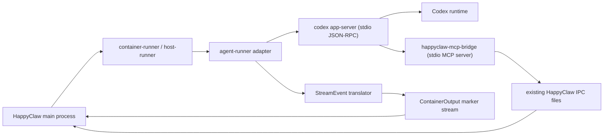

# HappyClaw -> Codex app-server Migration Design

Status: Proposed  
Primary audience: the engineer who will implement the migration  
Document goal: this document should be sufficient for a new owner to understand why the migration exists, what exactly should be built, what should not be built yet, and how to execute the work safely.

## 1. Executive Summary

The recommended migration path is:

1. Keep HappyClaw's outer product architecture intact.
2. Replace the Claude-specific runtime inside `container/agent-runner` with a new runtime built on top of `codex app-server`.
3. Preserve HappyClaw's existing `ContainerInput -> ContainerOutput -> StreamEvent` contract so the main process, WebSocket layer, IM integrations, and frontend can remain largely unchanged.
4. Continue exposing HappyClaw's existing internal tools through an MCP bridge process instead of reimplementing those tools inside the new runtime.
5. Run Claude and Codex side by side behind a feature flag or runtime selector until the Codex path is production-ready.

The migration should not start by rewriting HappyClaw into a general-purpose agent platform. It should start by preserving the current product shape and swapping the runtime layer under it.

This design intentionally chooses `codex app-server` instead of the public `@openai/codex-sdk` TypeScript SDK as the integration boundary because `codex app-server` exposes a richer, richer-client-oriented protocol: threads, turns, item lifecycle, deltas, interrupt, approvals, request-user-input, MCP, token usage updates, and skills. The public TypeScript SDK is useful, but too thin for a product that already depends on detailed agent runtime semantics.

## 2. Recommendation

The implementation should target:

- OpenAI Codex runtime surface: `codex app-server`
- HappyClaw compatibility boundary: the existing stdout marker protocol and `StreamEvent` schema
- Migration strategy: dual stack, incremental, reversible

The implementation should not target:

- `codex exec` internal JSONL details
- private Rust internals inside the Codex repository
- a runtime-neutral provider abstraction in phase 1
- a full product rewrite around a different community framework

## 3. Why This Migration Exists

HappyClaw is currently deeply coupled to the Claude agent runtime, not just to Anthropic as a model provider.

Today, HappyClaw relies on:

- multi-turn agent sessions
- stream-level text and reasoning updates
- tool lifecycle events
- in-process MCP tool exposure
- interrupt and resume semantics
- session persistence
- background task behavior
- conversation sub-agents
- memory and compaction behavior

That coupling lives in the runner and then propagates to the main process and frontend.

Relevant current code in HappyClaw:

- Agent runner entry: [container/agent-runner/src/index.ts](https://github.com/riba2534/happyclaw/blob/main/container/agent-runner/src/index.ts)
- Stream event translation: [container/agent-runner/src/stream-processor.ts](https://github.com/riba2534/happyclaw/blob/main/container/agent-runner/src/stream-processor.ts)
- MCP tools: [container/agent-runner/src/mcp-tools.ts](https://github.com/riba2534/happyclaw/blob/main/container/agent-runner/src/mcp-tools.ts)
- Container and host runner contract: [src/container-runner.ts](https://github.com/riba2534/happyclaw/blob/main/src/container-runner.ts)
- Output marker parsing: [src/agent-output-parser.ts](https://github.com/riba2534/happyclaw/blob/main/src/agent-output-parser.ts)
- Main process agent orchestration: [src/index.ts](https://github.com/riba2534/happyclaw/blob/main/src/index.ts)
- Runtime config: [src/runtime-config.ts](https://github.com/riba2534/happyclaw/blob/main/src/runtime-config.ts)
- Frontend streaming store: [web/src/stores/chat.ts](https://github.com/riba2534/happyclaw/blob/main/web/src/stores/chat.ts)

The migration exists because the target runtime should move from the Claude SDK runtime to an OpenAI-native runtime while keeping the surrounding product stable.

## 4. Why `codex app-server` and Not Other Options

### 4.1 Why not use `@openai/codex-sdk` directly

The public TypeScript SDK is intentionally thin. Its own README says it wraps the `codex` CLI and exchanges JSONL events over stdin/stdout:

- [sdk/typescript/README.md](https://github.com/openai/codex/blob/main/sdk/typescript/README.md)

That SDK is good for embedding Codex into workflows, but it exposes a much smaller surface area than HappyClaw currently consumes. In particular, HappyClaw benefits from:

- item-level lifecycle
- streamed reasoning deltas
- richer runtime notifications
- approval and request-user-input flows
- MCP and skill management surfaces

The public SDK is not the right boundary if the goal is to build a rich adapter that preserves HappyClaw's existing UI and process model.

### 4.2 Why not build on private Rust internals

The Codex repository is open source, but building a custom integration on internal crates or internal event flows would create a fragile maintenance burden:

- upstream internal contracts can change without the same compatibility expectations as the public client protocol
- future upgrades become expensive
- the migration would depend on reverse engineering instead of supported interfaces

If the team wants a custom SDK, it should be a custom client for `codex app-server`, not a custom wrapper over Codex internals.

### 4.3 Why `codex app-server`

`codex app-server` is the best fit because it is explicitly designed to power rich clients such as the Codex VS Code extension:

- [codex-rs/app-server/README.md](https://github.com/openai/codex/blob/main/codex-rs/app-server/README.md)

The app-server protocol supports:

- `thread/start`, `thread/resume`, `thread/fork`
- `turn/start`, `turn/steer`, `turn/interrupt`
- `item/started`, `item/completed`
- `item/agentMessage/delta`
- `item/reasoning/summaryTextDelta`
- `item/commandExecution/outputDelta`
- `thread/tokenUsage/updated`
- approvals
- `item/tool/requestUserInput`
- skill discovery
- MCP status and OAuth-related flows

This is the right shape for HappyClaw because HappyClaw is already a rich client around a local coding agent runtime.

### 4.4 Why not switch to a community framework instead

#### `pi`

`pi` is the strongest community alternative that was evaluated. It is a real coding harness with:

- sessions
- streaming events
- RPC mode
- SDK embedding
- tools
- skills
- extensions
- model-provider flexibility including OpenAI/Codex

Relevant references:

- [packages/coding-agent/README.md](https://github.com/badlogic/pi-mono/blob/main/packages/coding-agent/README.md)
- [packages/agent/README.md](https://github.com/badlogic/pi-mono/blob/main/packages/agent/README.md)

However, `pi` explicitly keeps important behaviors out of the core and expects users to build them through extensions:

- no MCP by default
- no sub-agents by default
- no permission popups by default
- no plan mode by default

That makes `pi` interesting as a backup option or as a future experimental branch, but not the best first migration path for HappyClaw. Using `pi` would still force HappyClaw to own many of the same runtime behaviors it already gets from Claude today.

#### `Mastra`

Mastra is powerful, but it is the wrong shape for this migration. It is an application framework for agents, workflows, memory, and HITL orchestration:

- [Mastra README](https://github.com/mastra-ai/mastra/blob/main/README.md)

Using Mastra would be a product rewrite, not a runtime migration. That is too wide a scope for the current objective.

## 5. Migration Goals

### 5.1 Phase 1 goals

Phase 1 must deliver:

- main HappyClaw conversations running on Codex
- per-group persistent sessions
- per-agent persistent sessions
- streaming assistant text
- streaming reasoning summaries
- tool lifecycle display in the existing frontend
- image input support
- interrupt support
- turn steering while a turn is still running
- existing HappyClaw internal tools through MCP
- basic token usage reporting
- dual-stack operation with Claude still available

### 5.2 Phase 1 non-goals

Phase 1 does not need to preserve every Claude-specific behavior.

These may be deferred:

- exact `PreCompact` hook behavior
- exact `Task` and `Team` semantics from the Claude SDK
- exact cost accounting
- runtime-neutral config schema
- ChatGPT-account login flows
- full approval UI
- pixel-perfect parity for task-agent UI cards

## 6. Current HappyClaw Runtime Boundary

The most important design constraint is this:

HappyClaw already has a stable compatibility boundary between the outer product and the inner runtime.

That boundary is:

- `ContainerInput`
- `ContainerOutput`
- stdout marker framing
- `StreamEvent`

Current references:

- `ContainerInput` and `ContainerOutput`: [src/container-runner.ts](https://github.com/riba2534/happyclaw/blob/main/src/container-runner.ts)
- output markers: [src/agent-output-parser.ts](https://github.com/riba2534/happyclaw/blob/main/src/agent-output-parser.ts)
- `StreamEvent`: [src/stream-event.types.ts](https://github.com/riba2534/happyclaw/blob/main/src/stream-event.types.ts)

This migration should preserve that boundary and swap the runtime beneath it.

In other words:

- the main process should continue to launch a runner process
- the runner should continue to emit marker-delimited JSON messages
- the frontend should continue to consume `StreamEvent`

This is the core design choice that keeps the migration tractable.

## 7. Target Architecture

### 7.1 High-level architecture



### 7.2 Core rules

- `codex app-server` is the runtime
- `agent-runner` is the adapter
- HappyClaw's internal tools remain implemented by HappyClaw itself
- MCP is the bridge between the Codex runtime and HappyClaw's business logic
- the main process remains unaware of Codex-specific protocol details

## 8. Storage Layout

### 8.1 Current state

Today, HappyClaw stores Claude runtime state under group- and agent-scoped `.claude` directories.

### 8.2 Target state

Add a parallel `.codex` home per conversation scope.

Recommended layout:

For a main group conversation:

```text
data/
  sessions/
    <group-folder>/
      .claude/
      .codex/
        config.toml
        sessions/
        auth.json
        logs/
```

For an agent conversation:

```text
data/
  sessions/
    <group-folder>/
      agents/
        <agent-id>/
          .claude/
          .codex/
            config.toml
            sessions/
            auth.json
            logs/
```

### 8.3 Why separate `.codex`

Do not try to reuse `.claude` for Codex state.

Reasons:

- avoids cross-runtime state collisions
- simplifies rollback
- keeps Claude and Codex runnable in parallel
- preserves an escape hatch if the migration stalls

## 9. Process Model

### 9.1 Outer process model

No change to the outer model:

- `runContainerAgent()` still launches the container-side runner
- `runHostAgent()` still launches the host-side runner
- `agent-output-parser.ts` still parses marker-delimited `ContainerOutput`

### 9.2 Inner process model

Inside the new Codex runtime mode, the runner must:

1. start `codex app-server` as a child process
2. initialize the JSON-RPC connection
3. prepare or reuse a per-scope `CODEX_HOME`
4. create or resume a thread
5. start the turn
6. translate notifications into `StreamEvent`
7. watch existing HappyClaw IPC directories for new messages, interrupts, and close signals
8. clean up deterministically

## 10. Thread and Session Mapping

### 10.1 Session identity

HappyClaw already stores a runtime session identifier and associates it with a group or agent conversation.

For Codex:

- HappyClaw `sessionId` should store the Codex `threadId`
- HappyClaw `turnId` should remain a HappyClaw-owned identifier used for UI correlation
- the runner should also track the current Codex turn id internally

### 10.2 Mapping rules

- main group conversation -> one Codex thread
- agent tab conversation -> one Codex thread
- scheduled isolated task run -> one dedicated Codex thread
- reset session -> discard thread id and start a new thread

### 10.3 Why this mapping is correct

Codex app-server's top-level conversation primitive is a thread:

- [codex-rs/app-server/README.md](https://github.com/openai/codex/blob/main/codex-rs/app-server/README.md)

That is the closest conceptual equivalent to HappyClaw's persisted runtime session.

## 11. Runtime Selection Strategy

### 11.1 Phase 1 recommendation

Do not attempt a single provider-neutral runtime schema in phase 1.

Instead:

- keep existing Claude provider config intact
- add a separate Codex-specific config surface
- add runtime selection at the system and group layer

Recommended new config shape:

- system default runtime: `claude_sdk` or `codex_app_server`
- optional group-level runtime override
- separate Codex runtime config object:
  - `openaiApiKey`
  - `openaiModel`
  - optional auth mode metadata

### 11.2 Why not a unified provider object in phase 1

HappyClaw's current provider model is semantically Claude-specific:

- `anthropicBaseUrl`
- `anthropicApiKey`
- `claudeCodeOauthToken`
- `claudeOAuthCredentials`
- `.claude`

Trying to neutralize this in the same change would combine:

- runtime migration
- provider schema redesign
- UI redesign
- persistence migration

That is too much risk in one step.

### 11.3 Phase 2 direction

Once Codex is stable:

- unify runtime config under a runtime-neutral abstraction
- move from `ClaudeProviderConfig` and `CodexProviderConfig` to a true backend model
- add runtime-scoped provider pools only after the Codex path is proven

## 12. How the Runner Should Talk to app-server

### 12.1 Transport

Use stdio JSON-RPC.

Rationale:

- official and supported
- simplest to supervise
- matches HappyClaw's existing local-process design
- avoids reliance on the app-server websocket mode, which is explicitly marked experimental in the app-server README

### 12.2 Client identity

The adapter should send a stable `clientInfo` in `initialize`.

Recommended value:

```json
{
  "name": "happyclaw",
  "title": "HappyClaw",
  "version": "<happyclaw-version>"
}
```

Note: the app-server docs mention client name usage in OpenAI compliance logging. If enterprise deployment later depends on official client recognition, that can be handled separately. It is not a blocker for the adapter.

### 12.3 Startup sequence

Runner startup sequence:

1. spawn `codex app-server`
2. send `initialize`
3. send `initialized`
4. if a stored thread id exists, call `thread/resume`
5. else call `thread/start`
6. call `turn/start`
7. read notifications until `turn/completed`

### 12.4 Reuse and resume rules

- on each successful turn, persist the returned thread id if it changed
- on future conversations, prefer `thread/resume`
- if resume fails due to a broken rollout or incompatible state, fall back to fresh `thread/start`

## 13. Instructions Injection Strategy

### 13.1 Requirements

The new runtime still needs:

- user profile context
- global memory recall
- formatting rules
- channel-specific guidance
- background task guidance
- security rules
- sub-conversation rules

### 13.2 Recommended injection model

Use:

- `baseInstructions` for HappyClaw-owned context and behavioral guidance
- avoid overriding `developerInstructions` in phase 1 unless absolutely necessary

Reason:

- `developerInstructions` is closer to Codex's own internal high-priority behavior layer
- overriding it too early increases the risk of damaging the default coding-agent behavior

Available request fields:

- `baseInstructions`
- `developerInstructions`

See:

- [ThreadStartParams](https://github.com/openai/codex/blob/main/codex-rs/app-server-protocol/schema/typescript/v2/ThreadStartParams.ts)
- [ThreadResumeParams](https://github.com/openai/codex/blob/main/codex-rs/app-server-protocol/schema/typescript/v2/ThreadResumeParams.ts)

### 13.3 What goes into `baseInstructions`

Recommended `baseInstructions` sections:

- user profile summary
- security rules
- memory recall summary
- output formatting guidance
- IM channel formatting guidance
- background task guidance
- sub-conversation behavior rules
- explicit HappyClaw MCP tool usage guidance

### 13.4 What does not go into `baseInstructions`

Do not try to mirror:

- the entire existing Claude preset structure
- Claude-specific system prompt XML wrappers
- hidden Codex internal developer prompt behavior

### 13.5 AGENTS.md vs CLAUDE.md

Codex naturally understands `AGENTS.md`-based repo guidance. HappyClaw today stores user memory and workspace behavior mostly in `CLAUDE.md`.

Phase 1 decision:

- do not rename or migrate user memory files
- do not generate permanent `AGENTS.md` mirrors
- instead, inject the relevant memory and behavior summary via `baseInstructions`

Phase 2 option:

- consider synthesizing ephemeral `AGENTS.md` projections for better repository-native behavior

## 14. MCP Bridge Design

### 14.1 Goal

Preserve HappyClaw's existing internal tool ecosystem without reimplementing tool business logic inside the Codex runtime.

### 14.2 Recommended design

Create a new stdio MCP server process:

- name: `happyclaw-mcp-bridge`
- one instance per runner
- context passed in by environment variables
- tool implementations reuse the current IPC file protocol already used by HappyClaw

### 14.3 Why a separate process

This is better than embedding tool implementations directly into the runner because:

- it matches Codex's MCP model
- it keeps the adapter thin
- it makes tool testing easier
- it allows future reuse outside the runner

### 14.4 Tool set

The initial tool set should preserve the current HappyClaw internal tools:

- `send_message`
- `send_image`
- `send_file`
- `schedule_task`
- `list_tasks`
- `pause_task`
- `resume_task`
- `cancel_task`
- `register_group`
- `install_skill`
- `uninstall_skill`
- `memory_append`
- `memory_search`
- `memory_get`

If some tools are not currently essential to phase 1, they may be implemented incrementally, but the bridge contract should be designed for the full set from day one.

### 14.5 Tool context

Pass runtime context through process environment:

- `HAPPYCLAW_CHAT_JID`
- `HAPPYCLAW_GROUP_FOLDER`
- `HAPPYCLAW_IS_HOME`
- `HAPPYCLAW_IS_ADMIN_HOME`
- `HAPPYCLAW_WORKSPACE_IPC`
- `HAPPYCLAW_WORKSPACE_GROUP`
- `HAPPYCLAW_WORKSPACE_GLOBAL`
- `HAPPYCLAW_WORKSPACE_MEMORY`

Do not bloat every tool schema with repeated identity arguments.

### 14.6 How Codex should discover the MCP bridge

The most robust phase 1 solution is:

- generate a per-runner `config.toml` in the scope-specific `CODEX_HOME`
- register the MCP bridge under `[mcp_servers.happyclaw]`
- start app-server with that `CODEX_HOME`

Representative config shape:

```toml
[mcp_servers.happyclaw]
command = "/app/bin/happyclaw-mcp-bridge"
args = []
startup_timeout_sec = 30
enabled = true
```

Exact supported config fields should be verified against the current Codex config reference at implementation time:

- [Codex config reference](https://developers.openai.com/codex/config-reference)

The migration should not depend on undocumented config keys.

## 15. Sandbox and Filesystem Policy

### 15.1 Current behavior

HappyClaw currently expresses isolation mostly through:

- container mounts
- host-mode working directory rules
- runtime-specific env flags

### 15.2 Target behavior

Codex app-server exposes a first-class sandbox policy model, including:

- `dangerFullAccess`
- `workspaceWrite`
- `readOnly`

References:

- [SandboxPolicy](https://github.com/openai/codex/blob/main/codex-rs/app-server-protocol/schema/typescript/v2/SandboxPolicy.ts)
- [ReadOnlyAccess](https://github.com/openai/codex/blob/main/codex-rs/app-server-protocol/schema/typescript/v2/ReadOnlyAccess.ts)

### 15.3 Phase 1 recommendation

Use `workspaceWrite` wherever possible instead of `dangerFullAccess`.

Recommended mapping:

- writable roots:
  - current group workspace
  - home memory if writable for this scope
  - global memory if writable for this scope
  - admin project root if applicable
- read-only roots:
  - read-only mounted workspace roots that the runtime may inspect
- network access:
  - preserve the current operational expectation for web and MCP tools

### 15.4 Why this matters

This produces a safer runtime without depending on Claude-style bypass semantics.

It also makes future approval and permission handling more coherent.

## 16. Skills Design

### 16.1 Current state

HappyClaw currently mounts project and user skills into the Claude runtime environment.

### 16.2 Phase 1 recommendation

For Codex:

- continue mounting project skills and user skills
- mirror or symlink them into the scope-specific `CODEX_HOME/skills`
- keep skill discovery local

This is simpler than building a separate remote skill registry path.

### 16.3 Optional phase 2 enhancement

The app-server supports `skills/list` and extra per-cwd user roots:

- [skills/list docs](https://github.com/openai/codex/blob/main/codex-rs/app-server/README.md)
- [SkillsListParams](https://github.com/openai/codex/blob/main/codex-rs/app-server-protocol/schema/typescript/v2/SkillsListParams.ts)

That can be used later for richer UI inspection, but it should not block phase 1.

## 17. Images and Attachments

### 17.1 Current state

HappyClaw sends images to the runner as base64 payloads.

### 17.2 Recommended mapping

Convert incoming base64 images into temporary local files inside the workspace and send them to Codex as `localImage` user input entries.

Relevant user input shape:

- [UserInput](https://github.com/openai/codex/blob/main/codex-rs/app-server-protocol/schema/typescript/v2/UserInput.ts)

### 17.3 Why local files instead of remote URLs

- no extra HTTP hosting layer required
- simpler lifecycle
- works naturally with existing workspace semantics
- easier debugging

### 17.4 Temporary file policy

Write staged images under:

```text
<workspace-group>/.happyclaw-input-images/
```

Cleanup policy:

- best-effort deletion after turn completion
- TTL-based janitor for safety

## 18. Turn Lifecycle: Start, Steer, Interrupt, Close

### 18.1 Start

When the main process sends a new user message:

- if no active turn exists, use `turn/start`

### 18.2 Steer

When a new user message arrives during an active turn:

- use `turn/steer`
- pass `expectedTurnId`

Relevant type:

- [TurnSteerParams](https://github.com/openai/codex/blob/main/codex-rs/app-server-protocol/schema/typescript/v2/TurnSteerParams.ts)

This is the proper replacement for the current Claude stream-based message injection pattern.

### 18.3 Interrupt

When HappyClaw writes `_interrupt`:

- the runner calls `turn/interrupt`
- it must wait for the terminal `turn/completed` with `status = interrupted`
- after that it can re-enter the IPC wait loop

### 18.4 `_close` and `_drain`

Preserve the current runner semantics:

- `_close`: terminate the interactive loop and shut down the runner
- `_drain`: finish the current result path and then exit once safe

The adapter should continue to expose these as `ContainerOutput` states, not force the main process to understand app-server internals.

## 19. Event Translation

### 19.1 Design principle

The frontend should continue to consume HappyClaw `StreamEvent`, not raw app-server notifications.

### 19.2 Phase 1 mapping table

| Codex app-server event | HappyClaw event | Notes |
| --- | --- | --- |
| `item/agentMessage/delta` | `text_delta` | Main text stream |
| `item/reasoning/summaryTextDelta` | `thinking_delta` | Preferred reasoning source |
| `item/reasoning/textDelta` | `thinking_delta` | Fallback only |
| `item/started` with `commandExecution` | `tool_use_start` | map as `Bash` |
| `item/completed` with `commandExecution` | `tool_use_end` | tool completion |
| `item/started` with `fileChange` | `tool_use_start` | map as `ApplyPatch` |
| `item/completed` with `fileChange` | `tool_use_end` | patch completion |
| `item/started` with `mcpToolCall` | `tool_use_start` | map to `mcp__server__tool` |
| `item/completed` with `mcpToolCall` | `tool_use_end` | final tool state |
| `item/mcpToolCall/progress` | `tool_progress` | optional progress |
| `turn/plan/updated` | `todo_update` | synthesize todo items |
| `thread/tokenUsage/updated` | `usage` | token-only phase 1 |
| `turn/completed` interrupted | `status` | `statusText = interrupted` |
| `thread/compacted` or `contextCompaction` item | `status` | compact status |
| `hook/started` | `hook_started` | if surfaced by app-server |
| `hook/completed` | `hook_response` | if surfaced by app-server |

### 19.3 What is intentionally not preserved in phase 1

Do not force a fake 1:1 mapping for:

- Claude nested `parentToolUseId` trees
- Claude `Task` and `TeamCreate` specific semantics
- Claude `PreCompact` callback timing

If the mapping becomes too synthetic, it becomes hard to trust and harder to maintain.

## 20. Usage and Billing

### 20.1 What Codex provides

App-server exposes token usage updates via `thread/tokenUsage/updated`:

- [ThreadTokenUsageUpdatedNotification](https://github.com/openai/codex/blob/main/codex-rs/app-server-protocol/schema/typescript/v2/ThreadTokenUsageUpdatedNotification.ts)

### 20.2 What phase 1 should store

Phase 1 token usage payload should include:

- `inputTokens`
- `outputTokens`
- `cacheReadInputTokens`
- `durationMs` measured by the adapter

Phase 1 should set:

- `cacheCreationInputTokens = 0`
- `costUSD = 0`
- `modelUsage = undefined`

### 20.3 Why phase 1 intentionally degrades cost accounting

HappyClaw's current billing and UI expect richer usage details than app-server guarantees in the same shape.

Trying to preserve exact cost semantics in phase 1 would force one of two bad choices:

- approximate costs from unverified assumptions
- overfit to internal provider behavior

The safer decision is to preserve token metrics first and cost metrics later.

## 21. Memory and Compaction

### 21.1 Current Claude-specific behavior

HappyClaw uses Claude-specific compaction and memory flush behavior in the runner.

### 21.2 Phase 1 recommendation

Do not attempt to recreate Claude's exact `PreCompact` hook semantics.

Instead:

- preserve explicit memory tools through MCP
- preserve current memory files on disk
- detect compaction through app-server item or thread notifications
- schedule post-turn or post-compaction memory consolidation asynchronously

### 21.3 Why this is acceptable

This changes timing, but not the product-level capability:

- memory still exists
- conversations can still be consolidated
- compaction remains observable

This is the right compromise for phase 1.

## 22. Agent Conversations and Internal Collaboration

### 22.1 HappyClaw conversation agents

HappyClaw's own conversation-agent abstraction must remain.

Each HappyClaw `agentId` should continue to map to:

- its own conversation tab
- its own runtime thread id
- its own persisted runtime state

### 22.2 Codex collaboration tools

Codex app-server also exposes collaboration tool items such as:

- `spawn_agent`
- `send_input`
- `resume_agent`
- `wait`
- `close_agent`

References:

- [collab tool item docs](https://github.com/openai/codex/blob/main/codex-rs/app-server/README.md)

### 22.3 Phase 1 decision

Do not fully integrate Codex collaboration items into HappyClaw's task-agent UI.

Instead:

- either disable sub-agent style collaboration in phase 1
- or surface collaboration items as normal tool timeline entries

This avoids building two different multi-agent abstractions at the same time.

### 22.4 Phase 3 direction

Later, if needed:

- map `collabToolCall` items to HappyClaw `task_start` and `task_notification`
- build a dedicated bridge from Codex subthreads to HappyClaw task cards

## 23. Approvals and Request-User-Input

### 23.1 Available capability

App-server supports:

- command approvals
- file change approvals
- permissions approvals
- `item/tool/requestUserInput`

See:

- [Approvals section](https://github.com/openai/codex/blob/main/codex-rs/app-server/README.md)

### 23.2 Phase 1 decision

Set approval policy to the equivalent of `never` in phase 1.

Reason:

- HappyClaw does not yet have a Codex-native approval UI
- approval support is a product-level feature, not a migration prerequisite

### 23.3 `request_user_input`

This is worth integrating earlier because HappyClaw already has UX patterns for AskUser-style interactions.

Recommended mapping:

- app-server `item/tool/requestUserInput` -> synthesize an `AskUserQuestion`-style tool event
- user response -> return JSON-RPC response to app-server and also update HappyClaw's UI state

### 23.4 Phase 2

Add proper UI for:

- command approval
- file-change approval
- permission grants

## 24. Host Mode and Container Mode

### 24.1 Keep both modes

HappyClaw should preserve both:

- host mode
- container mode

### 24.2 Container mode

Container mode remains the safest rollout target and should be the first environment validated.

### 24.3 Host mode

Host mode should follow after the container path works.

Special care is required for:

- working directory safety
- writable root calculation
- API key exposure
- local filesystem blast radius

## 25. Authentication Strategy

### 25.1 Phase 1

Use API-key auth only.

Practical recommendation:

- populate `OPENAI_API_KEY`
- optionally also support `CODEX_API_KEY` for compatibility with Codex tooling

The Codex repository contains support for both env names, but phase 1 should standardize on one operational path to reduce surprises.

### 25.2 What not to do in phase 1

Do not start with ChatGPT account login or OAuth browser flows.

Those can be added later after the runtime is stable.

### 25.3 Custom base URL

If enterprise proxying or custom model endpoints are required, validate the current Codex config reference before implementation. This should be treated as phase 2 unless it is a hard requirement for the first deployment.

## 26. File-by-File Implementation Plan

This section describes how the implementation should be organized in the HappyClaw repository.

### 26.1 Files that should remain the compatibility boundary

These should change as little as possible:

- [src/agent-output-parser.ts](https://github.com/riba2534/happyclaw/blob/main/src/agent-output-parser.ts)
- [src/stream-event.types.ts](https://github.com/riba2534/happyclaw/blob/main/src/stream-event.types.ts)
- [src/index.ts](https://github.com/riba2534/happyclaw/blob/main/src/index.ts)
- [web/src/stores/chat.ts](https://github.com/riba2534/happyclaw/blob/main/web/src/stores/chat.ts)

### 26.2 Files that should grow new runtime support

- [src/container-runner.ts](https://github.com/riba2534/happyclaw/blob/main/src/container-runner.ts)
- [src/runtime-config.ts](https://github.com/riba2534/happyclaw/blob/main/src/runtime-config.ts)
- [src/routes/config.ts](https://github.com/riba2534/happyclaw/blob/main/src/routes/config.ts)
- [web/src/pages/SetupProvidersPage.tsx](https://github.com/riba2534/happyclaw/blob/main/web/src/pages/SetupProvidersPage.tsx)

### 26.3 New runner modules to add

Recommended new files:

- `container/agent-runner/src/runtimes/codex/app-server-client.ts`
- `container/agent-runner/src/runtimes/codex/json-rpc.ts`
- `container/agent-runner/src/runtimes/codex/session-home.ts`
- `container/agent-runner/src/runtimes/codex/event-translator.ts`
- `container/agent-runner/src/runtimes/codex/input-staging.ts`
- `container/agent-runner/src/runtimes/codex/sandbox-policy.ts`
- `container/agent-runner/src/runtimes/codex/instructions.ts`
- `container/agent-runner/src/runtimes/codex/runtime.ts`
- `container/agent-runner/src/bridges/happyclaw-mcp-bridge.ts`

### 26.4 Suggested responsibilities

`app-server-client.ts`

- process spawn
- request ids
- request/response matching
- notification stream
- graceful shutdown

`session-home.ts`

- `.codex` directory creation
- `config.toml` generation
- auth file or env wiring
- skills symlink setup

`event-translator.ts`

- app-server notification to HappyClaw `StreamEvent`
- lifecycle synthesis
- usage payload shaping
- interrupted-state shaping

`input-staging.ts`

- base64 image staging
- local file path generation
- cleanup

`sandbox-policy.ts`

- convert HappyClaw mount/access model to Codex sandbox policy

`instructions.ts`

- build `baseInstructions`
- optional phase 2 `developerInstructions`

`runtime.ts`

- thread start/resume
- turn start/steer/interrupt
- IPC message loop
- marker output emission

`happyclaw-mcp-bridge.ts`

- stdio MCP server
- current internal tool schemas
- IPC bridge implementation

## 27. Suggested Runtime Loop Pseudocode

```ts
async function runCodexRuntime(input: ContainerInput) {
  const codexHome = await prepareCodexHome(input);
  const app = await startCodexAppServer({ codexHome, env: buildAuthEnv(input) });

  await app.initialize({
    clientInfo: {
      name: "happyclaw",
      title: "HappyClaw",
      version: HAPPYCLAW_VERSION,
    },
  });

  const threadId = input.sessionId
    ? await tryResumeThread(app, input.sessionId)
    : await startThread(app, {
        cwd: WORKSPACE_GROUP,
        baseInstructions: buildBaseInstructions(input),
        sandbox: buildSandboxPolicy(input),
      });

  let activeTurn = await startTurn(app, threadId, toCodexInputs(input));

  while (true) {
    const event = await Promise.race([
      app.nextNotification(),
      nextHappyClawIpcEvent(),
    ]);

    if (isAppServerNotification(event)) {
      for (const output of translateToContainerOutputs(event)) {
        emitMarkedOutput(output);
      }
      if (isTurnCompleted(event)) {
        activeTurn = null;
      }
      continue;
    }

    if (event.type === "interrupt" && activeTurn) {
      await app.interruptTurn(threadId, activeTurn.id);
      continue;
    }

    if (event.type === "message") {
      if (activeTurn) {
        await app.steerTurn(threadId, activeTurn.id, toCodexInputs(event));
      } else {
        activeTurn = await startTurn(app, threadId, toCodexInputs(event));
      }
      continue;
    }

    if (event.type === "close") {
      break;
    }
  }
}
```

## 28. Rollout Strategy

### 28.1 Phase 0: scaffolding

- add config flag for runtime selection
- add `.codex` home creation
- add `codex app-server` process management
- no production traffic yet

### 28.2 Phase 1: hidden dual stack

- enable Codex runtime only behind an explicit config flag
- keep Claude as default
- use internal test groups only

### 28.3 Phase 2: limited production

- allow selected groups or users to opt into Codex
- compare session stability and UX quality
- keep rollback path immediate

### 28.4 Phase 3: broader adoption

- default new groups to Codex when quality is acceptable
- continue supporting Claude until migration confidence is high

## 29. Testing Strategy

### 29.1 Unit tests

Add tests for:

- JSON-RPC framing
- thread start/resume fallback logic
- interrupt flow
- `turn/steer` path
- image staging
- sandbox policy generation
- event translation
- MCP bridge tool schemas
- token usage conversion

### 29.2 Integration tests

Use a mocked app-server or fixture process to simulate:

- normal text turn
- command execution turn
- file change turn
- MCP tool invocation
- interrupted turn
- request-user-input turn
- compacted turn
- token-usage updates

### 29.3 End-to-end product tests

Validate from the HappyClaw product surface:

- Web main conversation
- image upload
- interrupt button
- agent sub-tab conversation
- memory append/search/get
- scheduled task creation and execution
- IM `send_message` during a long turn

### 29.4 Regression targets

The migration is acceptable only if these remain true:

- no frontend protocol rewrite is required
- no DB migration is needed for basic conversations
- no IM channel loses basic reply capability

## 30. Acceptance Criteria

Phase 1 is complete when:

- a HappyClaw group can run on Codex with no code changes required in the main process call site
- a conversation persists and resumes across turns
- the UI shows streamed text
- the UI shows reasoning updates
- the UI shows tool timeline entries
- interrupt works
- images work
- memory MCP tools work
- `send_message` works during a running turn
- token usage is stored and displayed at a basic level
- Claude runtime still works when selected

## 31. Risks and Mitigations

### 31.1 Risk: prompt-layer mismatch degrades Codex behavior

Mitigation:

- keep phase 1 on `baseInstructions`
- avoid heavy `developerInstructions`
- test with realistic coding tasks before rollout

### 31.2 Risk: MCP bridge startup or auth issues block turns

Mitigation:

- per-runner health check before `turn/start`
- surface MCP startup failures as clear `status` outputs
- keep bridge logs in the `.codex/logs` scope directory

### 31.3 Risk: compaction behavior differs from Claude

Mitigation:

- treat exact PreCompact parity as deferred
- implement async consolidation after turn or compaction event

### 31.4 Risk: token billing regressions

Mitigation:

- separate token metrics from dollar accounting
- preserve token reporting first
- mark cost as unsupported in phase 1

### 31.5 Risk: host mode is less safe than Claude path today

Mitigation:

- ship container mode first
- keep host mode behind a separate flag until verified

### 31.6 Risk: trying to do runtime-neutral config too early

Mitigation:

- keep phase 1 runtime-specific
- normalize only after the Codex path is working

## 32. Deferred Work

These items are explicitly deferred unless a hard product requirement forces them earlier:

- ChatGPT account auth
- custom OpenAI-compatible base URL support
- full approval UX
- Codex collab sub-agent UI
- precise cost accounting
- runtime-neutral provider model
- generated `AGENTS.md` mirrors from `CLAUDE.md`

## 33. Execution Order

Recommended implementation order:

1. Add runtime selection and Codex config storage.
2. Add `.codex` home creation and app-server process bootstrap.
3. Implement `thread/start`, `thread/resume`, and `turn/start`.
4. Implement basic event translation for text, reasoning, command/file/tool lifecycle.
5. Implement `turn/interrupt`.
6. Implement `turn/steer`.
7. Implement image staging.
8. Implement `happyclaw-mcp-bridge` for `send_message`, memory tools, and task tools.
9. Hook token usage into the existing persistence flow.
10. Wire the frontend compatibility fixes, if any.
11. Test container mode end to end.
12. Enable dual-stack rollout.
13. Revisit approvals, compaction parity, and sub-agents in later phases.

## 34. Final Decision

This migration should be treated as:

- a runtime adapter project
- not a framework rewrite
- not a provider abstraction rewrite
- not a UI rewrite

The correct implementation mindset is:

- preserve the outer product
- replace the inner runtime
- defer parity edge cases that do not block usability
- keep the change reversible until Codex is proven in production

## 35. Reference Links

OpenAI:

- [Codex overview](https://developers.openai.com/codex)
- [Codex SDK docs](https://developers.openai.com/codex/sdk)
- [Codex config reference](https://developers.openai.com/codex/config-reference)
- [Codex AGENTS.md guide](https://developers.openai.com/codex/guides/agents-md)
- [OpenAI Codex repository](https://github.com/openai/codex)
- [app-server README](https://github.com/openai/codex/blob/main/codex-rs/app-server/README.md)

HappyClaw:

- [HappyClaw repository](https://github.com/riba2534/happyclaw)
- [agent runner entry](https://github.com/riba2534/happyclaw/blob/main/container/agent-runner/src/index.ts)
- [stream processor](https://github.com/riba2534/happyclaw/blob/main/container/agent-runner/src/stream-processor.ts)
- [MCP tools](https://github.com/riba2534/happyclaw/blob/main/container/agent-runner/src/mcp-tools.ts)
- [container runner](https://github.com/riba2534/happyclaw/blob/main/src/container-runner.ts)
- [output parser](https://github.com/riba2534/happyclaw/blob/main/src/agent-output-parser.ts)
- [main orchestration](https://github.com/riba2534/happyclaw/blob/main/src/index.ts)
- [runtime config](https://github.com/riba2534/happyclaw/blob/main/src/runtime-config.ts)
- [frontend chat store](https://github.com/riba2534/happyclaw/blob/main/web/src/stores/chat.ts)

Community alternatives considered:

- [pi coding agent](https://github.com/badlogic/pi-mono/tree/main/packages/coding-agent)
- [pi agent core](https://github.com/badlogic/pi-mono/tree/main/packages/agent)
- [Mastra](https://github.com/mastra-ai/mastra)
